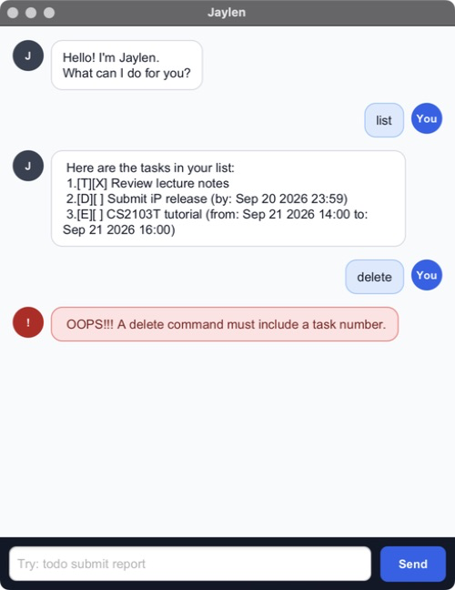

# Jaylen User Guide

Jaylen is a desktop task assistant that keeps track of todos, deadlines, and
events through short text commands.



## Quick start

1. Install Java 25.
2. Download `jaylen.jar` from the
   [latest GitHub release](https://github.com/nyxkk/ip/releases/latest).
3. Put the JAR in the folder where you want Jaylen to keep its data.
4. Open a terminal in that folder and run:

   ```bash
   java -jar jaylen.jar
   ```

5. Enter a command in the box at the bottom, then press <kbd>Enter</kbd> or
   select **Send**.

Jaylen saves every successful change automatically. Type `bye` when you are
finished.

## Understanding the task list

Each task begins with two markers:

- `[T]`, `[D]`, or `[E]` means todo, deadline, or event respectively.
- `[ ]` means incomplete, while `[X]` means completed.

The number shown by `list` or `find` is the `TASK_NUMBER` used by commands such
as `mark`, `unmark`, and `delete`.

## Adding tasks

### Add a todo

Format: `todo DESCRIPTION`

```text
todo Read the software engineering chapter
```

### Add a deadline

Format: `deadline DESCRIPTION /by DATE_OR_DATE_TIME`

```text
deadline Submit reflection /by 2026-09-25 23:59
```

### Add an event

Format: `event DESCRIPTION /from DATE_TIME /to DATE_TIME`

```text
event CS2103T tutorial /from 2026-09-21 14:00 /to 2026-09-21 16:00
```

The event end must be later than its start.

## Viewing and updating tasks

### List every task

Format: `list`

### Mark a task as completed

Format: `mark TASK_NUMBER`

```text
mark 1
```

### Mark a task as incomplete

Format: `unmark TASK_NUMBER`

```text
unmark 1
```

### Delete a task

Format: `delete TASK_NUMBER`

```text
delete 2
```

### Find tasks

Format: `find TERM [MORE_TERMS]`

```text
find software chapter
```

Search is case-insensitive and each term can match part of a word. A task is
shown only when its description contains every term, in any order. Results
keep their original task numbers.

### Exit Jaylen

Format: `bye`

## Command and date rules

- Command words are lowercase.
- Extra spaces before, after, or between command parts are accepted.
- Descriptions must contain text and cannot contain the `|` character.
- A task number must be a positive number currently shown by `list` or `find`.
- Dates can use `YYYY-MM-DD` or `D/M/YYYY`.
- Date-times use either date format followed by a 24-hour time in `HHmm` or
  `HH:mm` format.

Examples of accepted values include `2026-09-25`, `25/9/2026`,
`2026-09-25 1800`, and `25/9/2026 18:00`.

If a command is invalid, Jaylen highlights the error and explains how to fix it.
It continues running so that you can try another command.

## Saving data

Jaylen stores tasks in `data/jaylen.txt`, relative to the folder from which the
JAR is launched. The folder and file are created automatically.

If the save file is unreadable or malformed, Jaylen shows a startup warning and
disables commands that change tasks. This prevents the existing file from
being overwritten; fix or move the file, then restart Jaylen.

## Command summary

| Action | Command |
|---|---|
| Add a todo | `todo DESCRIPTION` |
| Add a deadline | `deadline DESCRIPTION /by DATE_OR_DATE_TIME` |
| Add an event | `event DESCRIPTION /from DATE_TIME /to DATE_TIME` |
| List tasks | `list` |
| Mark completed | `mark TASK_NUMBER` |
| Mark incomplete | `unmark TASK_NUMBER` |
| Delete a task | `delete TASK_NUMBER` |
| Find tasks | `find TERM [MORE_TERMS]` |
| Exit | `bye` |
